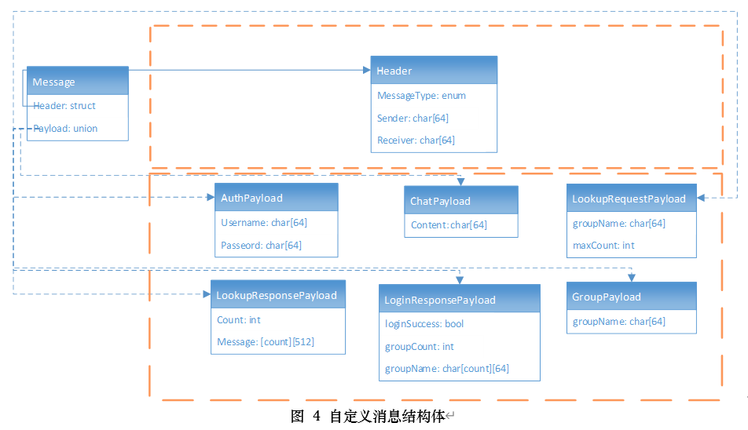
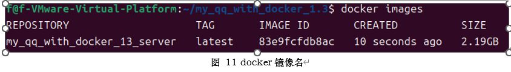

# Linux-
基于Ubuntu的多人聊天室项目
# 开发环境版本：
- 操作系统：Ubuntu 24.04.2 LTS
- 编程语言：C++13.3.0
- 客户端开发：Qt 5.12.12 
- 服务端开发：GCC + POSIX + epoll
- 数据库：MySQL 8.0
- 编译工具：CMake + Qt Creator
- 图形库：Qt Widgets
# 项目简介：
## 项目技术路线

# 安装步骤：
1. 下载项目
2. 进入服务端目录
3. 执行`docker-compose build` 
4. 执行`docker-compose up -d`

5. 进入客户端目录
6. 执行`chmod  -R 777 my_qq-1-3_client.sh` 
7. 执行`./ my_qq-1-3_client.sh`
# 实机演示
## 客户端界面

